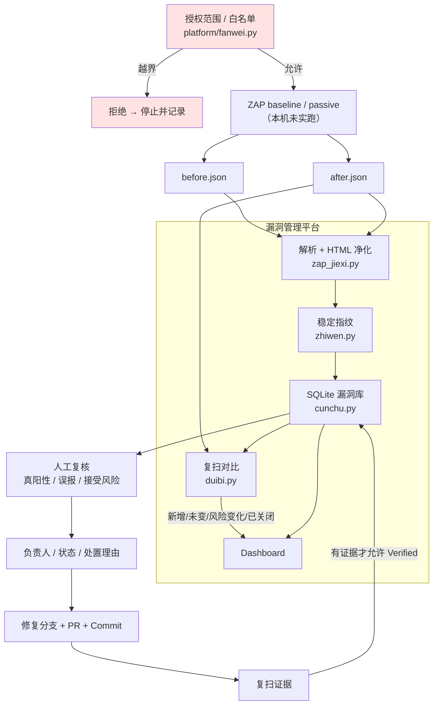

# ⚠️ 请先读这一段

> **本平台只允许用于扫描你自己拥有、或已获得书面授权的目标。**
>
> - 默认白名单**只放开本机回环地址**（`localhost` / `127.0.0.1`）
>   和本 Compose 服务名；**公网域名一律拒绝**。
> - **私网地址不会自动视为已授权**（`192.168.x.x`、`10.x.x.x` 也必须显式配置）。
> - **任何重定向到白名单外主机的行为都会被立即拦下。**
> - 平台**不包含**主动扫描、爆破、漏洞利用功能。
> - 未经授权扫描他人系统在多数司法管辖区属于**违法行为**。
>
> 授权记录见 [scope.md](scope.md)，生效配置见
> `platform/fanwei-peizhi.json`。
>
> **紧急停止**：关掉被测目标进程；平台侧没有绕过白名单的入口
> （生成扫描命令的函数会先校验，校验不过直接抛异常）。

---

# vuln-management-platform —— 软件安全检测与漏洞管理平台

《开源软件与新技术》实验07 成品。以 **OWASP ZAP** 为检测工具概念基线，
自己实现一个轻量的**漏洞管理平台**：把扫描报告转成可追踪的风险，
完成"**授权门禁 → 导入告警 → 指纹去重 → 人工复核 → 指派与处置 →
修复 Commit → 复扫对比 → 状态 Verified**"的完整闭环。

在实验要求之外补了一项自主扩展：**跨扫描的稳定指纹去重 + 覆盖度校验防假关闭**。

- 作者：王锐兵（软件2304，学号 23110506126）
- 仓库：<https://github.com/remchang/vuln-management-platform>

> 本仓库是二次开发成品，**不是** ZAP / DefectDojo / Juice Shop 的再分发。
> "上游能力 vs 本人实现"的逐项对照见 [NOTICE.md](NOTICE.md)。

---

## 一、目标用户与问题场景

**目标用户**：一个人负责几个小系统的学生开发者 / 实验室维护者。

**问题场景**：安全扫描器能一次吐出一堆告警，但**告警不是结论**。
真实的工作流要回答这些问题：

| 问题 | 现状 |
| --- | --- |
| 这条告警是真的还是误报？ | 报告里没有"复核结论"这一栏 |
| 上次也有这条，是新增还是老问题？ | 每次都只能靠肉眼比两份报告 |
| 谁负责修？修到哪一步了？ | 没有负责人，没有状态 |
| 修完了怎么证明？ | 只能说"我改了"，没有复扫证据 |
| 这条告警对应的页面这次扫到了吗？ | 报告里看不出来，容易被"假关闭"骗过去 |

**功能清单**：

| 功能 | 说明 |
| --- | --- |
| **授权门禁** | 扫描前强制校验目标；私网不自动授权；重定向越界即停 |
| 报告导入 | 解析 ZAP Traditional JSON，容忍缺字段/空 site/格式异常 |
| **稳定指纹去重** | 规则ID + 规范化路径 + 参数；重复导入不重复创建 |
| 风险分级 | 按 riskcode 映射高/中/低/信息 |
| 人工复核 | 记录真阳性/误报/接受风险及理由 |
| 工作流 | 7 个状态，**没有修复 Commit 和复扫证据不允许置为 Verified** |
| 复扫对比 | 新增 / 未变 / 风险变化 / 已关闭；**覆盖不足时警告且拒绝判定修复** |
| Dashboard | 风险分布、状态分布、前后变化 |
| 脱敏 | 报告中的敏感值在展示前替换 |

---

## 二、技术栈与架构

| 组件 | 说明 |
| --- | --- |
| 平台核心 | Python 3.13 + SQLite（标准库），无外部服务依赖 |
| 界面 | Streamlit（代码已写，**本机未安装，界面未实跑**） |
| 检测工具 | OWASP ZAP 2.17.0（**本机未安装，未实跑**） |
| 被测目标 | 本人编写的本地 HTTP 演示应用（标准库） |
| 测试 | pytest |

### 架构



### 架构说明

1. **范围校验发生在扫描前，不能靠口头保证。**
   `shengcheng_saomiao_mingling()` 先调 `jiaoyan_mubiao()`，
   不通过就抛异常，没有"先扫再说"的口子。
2. **告警经解析和人工复核后才成为可处置漏洞。**
   导入只是"搜集证据"，复核才是"下结论"。
3. **稳定指纹用规则 ID + 规范化 URL/参数，不能只靠描述文本。**
   描述文本会随版本变，路径参数要区分。
4. **关闭必须有修复 Commit 与复扫证据，不能手工改成 Done。**
   这条写成了代码里的硬约束，有测试盯着。

---

## 三、指纹算法（自主扩展的核心）

```
指纹 = SHA256( 规则ID | 规范化origin | HTTP方法 | 规范化路径 | 规范化参数 )
```

规范化规则：

| 处理 | 说明 |
| --- | --- |
| 去掉随机查询值 | `?_=1712345678`、`cachebuster=xxx` 这类一键生成的参数会被剔除 |
| 参数名排序 | `?b=2&a=1` 与 `?a=1&b=2` 视为同一资源 |
| 路径保留 | **不能**把 `/user/1` 和 `/user/2` 合并——那是不同资源 |
| 参数名保留 | **不能**把 `?id=1` 和 `?name=x` 合并 |

**三个容易误合并/漏合并的反例**（在测试里有对应用例）：

| 反例 | 错在哪 | 处理 |
| --- | --- | --- |
| `POST /api/user?id=1` vs `GET /api/user?id=1` | 方法不同却是不同端点 | 方法进指纹 |
| `/item/1001` vs `/item/1002` | 路径里带资源 ID | 路径**原样**进指纹，不归一化数字 |
| `?id=1` vs `?uid=1` | 参数名不同、含义可能不同 | 参数**名**进指纹 |

还有一个易漏的：**同一条 alert 可能有多个 instances**（同一个规则命中多个 URL）。
如果按 alert 建一条记录，就会漏掉其他实例。
本实现是**按 instance 建 Finding**，每个实例一条。

---

## 四、状态定义

| 状态 | 含义 | 谁能进入 |
| --- | --- | --- |
| `New` | 刚导入，未复核 | 导入时自动 |
| `Confirmed` | 人工复核确认为真阳性 | 复核 |
| `False Positive` | 人工复核判定为误报 | 复核 |
| `Accepted Risk` | 确认存在但业务上接受 | 复核 |
| `In Progress` | 已指派、正在修 | 需负责人 |
| `Resolved` | 已修复，等待复扫确认 | 需修复 Commit |
| `Verified` | **复扫不再出现 或 人工验证关闭** | ★ **必须有复扫证据** |

**硬约束**：把状态直接改成 `Verified` 而没有任何修复 Commit 或复扫批次记录，
会被 `cunchu.py` 拒绝并抛错。
测试 `test_meiyou_zhengju_buneng_verified` 专门盯这条。

> 只有 `Verified` 表示"真的关掉了"。`Resolved` 只是"我认为修好了"。

---

## 五、安装与运行

```powershell
.\scripts\anzhuang.ps1     # 建 venv、装依赖、跑测试
.\scripts\ceshi.ps1        # 只跑测试
```

跑界面（需要自己装 Streamlit，本机未装）：

```powershell
.\.venv\Scripts\python -m pip install streamlit -i https://mirrors.aliyun.com/pypi/simple/
.\.venv\Scripts\python -m streamlit run app.py
```

界面第一屏就是法律与范围警告。

### 起一个被测目标

```powershell
.\scripts\qidong-mubiao.ps1              # 起未修复版（缺安全头），监听 127.0.0.1:8000
.\scripts\qidong-mubiao.ps1 -AnquanBan   # 起修复版（补齐安全头），用来演示复扫
```

---

## 六、扫描强度与命令

```powershell
.\scripts\saomiao.ps1 -Mubiao "http://127.0.0.1:8000"
```

脚本**先过白名单校验**，通过后打印 ZAP 命令。两种路线：

**原生路线（推荐，不需要 Docker）**

```powershell
.\jre\bin\java.exe -Xmx512m -jar .\ZAP_2.17.0\zap-2.17.0.jar `
  -daemon -silent -host 127.0.0.1 -port 8081 `
  -dir .\data\zap -config "api.key=<本地随机密钥>"
```

然后通过官方 API 对白名单内的 URL 调 `core/action/accessUrl`，
`followRedirects=false`；轮询 `pscan/view/recordsToScan` 为 0 后，
用 `core/other/jsonreport` 与 `htmlreport` 保存报告。
**只发普通请求并检查响应，不调用 `ascan`。**

**容器路线（本机无 Docker，未执行）**

```powershell
docker compose run --rm zap zap-baseline.py -t http://mubiao:8000 -J zap-before.json -r zap-before.html
```

> `zap-baseline.py` **包含爬取与被动规则**，不等同于零网络行为，
> 只能用于已批准的目标。
> 退出码 1/2 表示发现了 WARN/FAIL，**不是程序崩溃**。

**扫描强度**：本实验只做被动检查（passive scan）。
主动扫描（`ascan`）、认证扫描、提高强度的动作**均未获批准**。

---

## 七、测试

```powershell
.\.venv\Scripts\python -m pytest tests -q
```

**实测结果：32 passed in 2.83s**

| 测试类型 | 实验要求 | 本仓库 | 文件 |
| --- | --- | --- | --- |
| 范围安全测试 | ≥6 | 7 | `tests/test_fanwei.py` |
| 解析/去重测试 | ≥8 | 10 | `tests/test_jiexi_zhiwen.py` |
| 工作流测试 | ≥6 | 7 | `tests/test_cunchu.py` |
| 修复回归测试 | ≥3 | 5 | `tests/test_xiufu.py` |
| 复扫比较 | ≥2 | 3 | `tests/test_duibi.py` |

细节与失败用例见 [docs/ceshi-jilu.md](docs/ceshi-jilu.md)。

---

## 八、报告处理与脱敏

| 项 | 做法 |
| --- | --- |
| HTML 净化 | `desc` / `solution` 里含 HTML，展示前用 `qu_html` 转成纯文本，**不把扫描证据当可信 HTML 执行** |
| 敏感值 | URL 里的 token、Cookie 片段等在展示前替换为 `***` |
| 报告存放 | 限制在本机项目目录，不对外发布 |
| 报告哈希 | 导入时记录报告文件 SHA256，便于核对用的是哪一份 |
| 原始报告 | 提交前人工过一遍，确认无真实凭据与个人信息 |

---

## 九、★ 已知限制（重要，如实记录）

### 9.1 本机没有 ZAP，也没有 Docker

**没有对任何目标执行过真实的 ZAP 扫描。**

- `reports/zap-before.json` 和 `reports/zap-after.json` 是
  **人工构造的测试夹具**，严格按 ZAP Traditional JSON 的真实结构编写，
  用来验证"解析 → 指纹 → 状态 → 对比"这套逻辑。
- 夹具**不代表**任何系统的真实扫描结果。
- ZAP 的下载、安装、启动、扫描命令都已写好（`scripts/saomiao.ps1`），
  但**未在本机执行**。

### 9.2 界面未实跑

Streamlit 本机未安装（下载依赖较大），`app.py` 的界面**没有实际渲染验证过**。
平台的核心逻辑全部在 `platform/` 目录里，不依赖 Streamlit，
由 32 条测试覆盖。

### 9.3 其他

- 不扫描公网目标，也不支持。
- 没有做 SARIF 或其他扫描器的适配（DefectDojo API 导入属于自主扩展的候选，
  本次没做）。
- 没有实现 SLA 与逾期提醒。
- 人工复核记录是**我本人做的判断**，不是安全专家的结论。

### 9.4 已实测的部分

- **32 条测试全部实跑通过**（`pytest -q` → 32 passed in 2.83s）
- 范围门禁、指纹去重、状态门禁、复扫对比都是真实执行的代码路径
- 被测目标应用（未修复版/修复版）是真实可运行的本地 HTTP 服务

---

## 十、目录结构

```
vuln-management-platform/
├── README.md
├── LICENSE                      # MIT + 安全工具额外声明
├── NOTICE.md                    # 上游能力 vs 本人实现的逐项对照
├── scope.md                     # ★ 授权范围记录
├── app.py                       # Streamlit 界面（含首屏法律警告）
├── platform/                    # ★ 平台核心（不依赖 Streamlit）
│   ├── fanwei.py                #   授权门禁
│   ├── fanwei-peizhi.json       #   白名单配置
│   ├── zap_jiexi.py             #   ZAP JSON 解析 + HTML 净化
│   ├── zhiwen.py                #   稳定指纹
│   ├── cunchu.py                #   SQLite 存储 + 状态门禁
│   └── duibi.py                 #   复扫对比
├── target/                      # 被测目标（本人编写的本地演示应用）
│   ├── app.py                   #   未修复版（缺安全头）
│   └── app_yiuxiu.py            #   修复版
├── reports/                     # ⚠️ 人工构造的 ZAP 报告夹具
│   ├── README.md
│   ├── zap-before.json
│   └── zap-after.json
├── tests/                       # 32 条 pytest
├── scripts/                     # 安装/起目标/扫描/导入/测试
└── docs/                        # 报告、Issue、测试记录、人工复核记录
```

---

## 十一、思考题

**1. 扫描器告警在什么条件下才应成为 Confirmed 漏洞？**

至少要满足三条：

1. **可达性**：这个 URL 在真实部署里能访问到（不是只在开发配置下存在）。
2. **可复现**：人工按告警给的 URI/参数重放一次，现象一致（不是扫描器的误判或缓存假象）。
3. **影响了什么**：说清这条告警在业务上意味着什么风险、谁能利用、影响范围。

只满足"扫描器报了"是不够的。本平台的 `New` → `Confirmed`
必须由人工复核填写**判定理由**才能通过，就是把这一步制度化。

**2. 风险等级应完全采用工具评级，还是结合资产、可达性和业务影响？**

不能完全采用工具评级。工具只看 HTTP 响应，看不到：

- 这个接口是不是需要登录（不可达则风险极低）
- 挂掉的这个组件是不是已经在用了（未使用的库不算风险）
- 业务上这条数据敏不敏感

所以正确的做法是：**工具评级作为输入，人工复核时结合资产重要性和业务影响调整**，
并且把调整理由记录下来。本平台允许人工改风险等级，
但要求填处置理由——就是为了留下这个判断依据。

**3. 稳定指纹如何在避免重复和避免错误合并之间取舍？**

核心是**只归一化"确实等价"的东西，不归一化"可能不等价"的东西**：

| 归一化 | 安全吗 | 理由 |
| --- | --- | --- |
| 随机查询值（`_=`、`cachebuster`） | ✅ 安全 | 只影响缓存，不改变资源 |
| 参数顺序 | ✅ 安全 | `?a=1&b=2` 和 `?b=2&a=1` 是同一个请求 |
| 路径里的数字 ID | ❌ **危险** | `/item/1` 和 `/item/2` 是不同资源 |
| 参数名 | ❌ 危险 | `?id=` 和 `?uid=` 可能语义不同 |

宁可**偶尔多建一条**（重复），也不要**错误合并**（漏掉真实漏洞）。
重复可以人工合并，漏掉则永远不会被发现。

**4. 为什么"复扫不再出现"仍可能不足以证明修复？**

因为"不再出现"有四种可能，只有第一种是真的修好了：

| 可能 | 怎么区分 |
| --- | --- |
| ① 真的修好了 | 确认 after 扫描**覆盖了原页面**，且规则集相同 |
| ② 页面这次没被爬到 | 对比 before/after 的 URL 覆盖集合 |
| ③ 规则没加载 / 规则集变了 | 对比两轮使用的规则配置 |
| ④ 目标换了（旧容器还在跑 / Commit 不对） | 确认目标 Commit 与容器镜像 |

本平台的做法：`duibi.py` 会**对比两次扫描的 URL 覆盖集合**，
如果 after 的覆盖明显小于 before，返回"覆盖不足，不能判定修复"的警告，
状态只能停在 `Resolved`，**不允许**进 `Verified`。

**5. 安全报告中哪些信息需要脱敏，而过度脱敏又会损害什么证据？**

| 需要脱敏 | 为什么 |
| --- | --- |
| Token、Cookie、Authorization 头 | 泄露即可被利用 |
| 真实个人数据（姓名、手机号、邮箱） | 隐私 |
| 内网主机名、内网 IP、拓扑 | 帮助攻击者 |
| 完整的技术栈版本号 | 便于定位已知漏洞 |

**过度脱敏的代价**：如果把 URL 和参数的**具体形态**模糊掉，
就无法复现、无法验证修复、也无法判断两条告警是不是同一件事。

所以正确的边界是：**保留"能复现问题"的信息（方法、路径、参数名、
规则 ID），抹掉"能直接利用"的信息（凭据值、真实数据）**。
本平台的 `qu_html` 与脱敏只处理值，不动结构。
